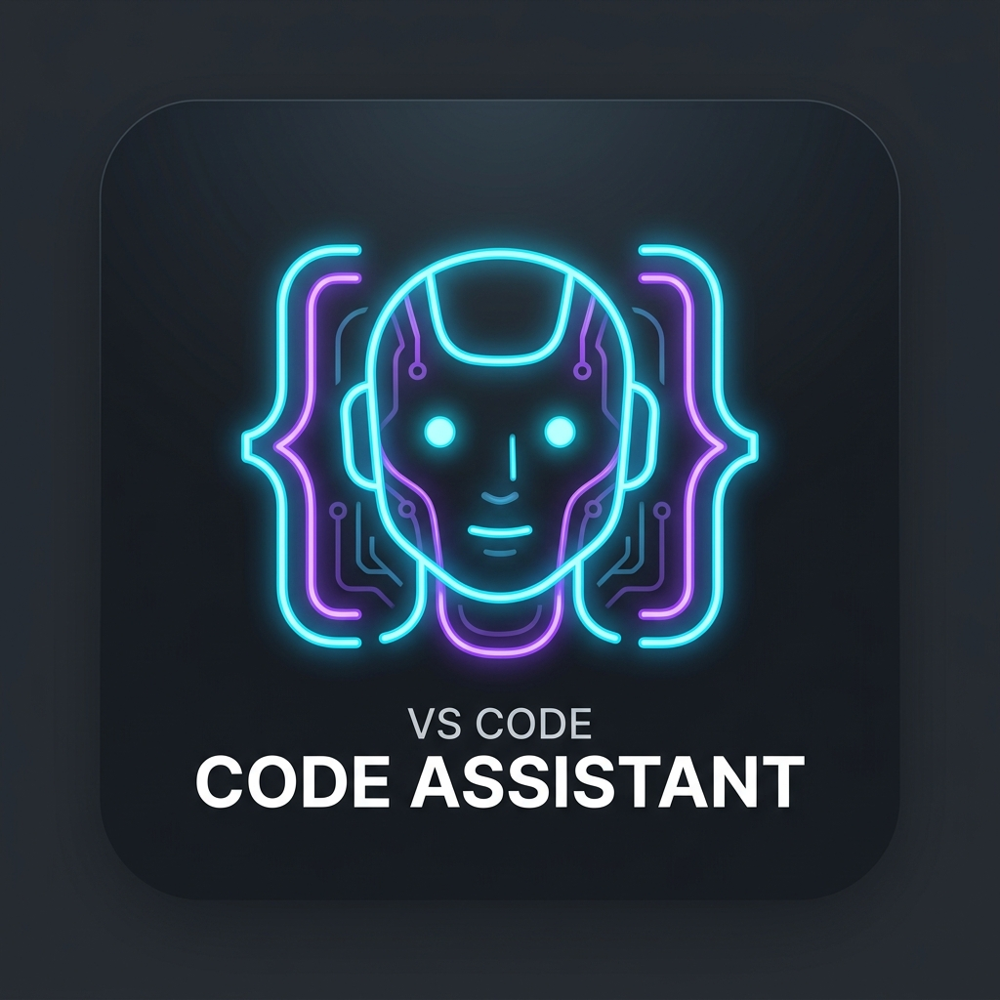

# CodeRun AI Agent 🚀

<p align="center">
  
</p>

[](package.json)
[](https://opensource.org/licenses/MIT)
[](https://nodejs.org)
[](https://github.com/nbsgr/qwen-coderun-agent)

**CodeRun AI Agent** is an autonomous coding agent for VS Code powered by **Qwen 3.7 through the browser API** (`chat.qwen.ai`). It executes complex development workflows via an iterative Think → Plan → Act → Verify loop: reading, writing, and editing files, running terminal commands, searching codebases, inspecting user screenshots, and generating images natively with **Qwen Wanx** — all with complete local context management and tool permission controls.

---

## 🌟 How It Works

Unlike traditional AI extensions that rely on standard OpenAI-compatible endpoints with metered billing, CodeRun communicates directly with Qwen through the **browser chat API** — the same API powering `chat.qwen.ai`.

```
User Prompt (+ Images/Docs) → Extension → Qwen Browser API → SSE Response Stream
  → Streaming JSON extractor parses reasoning, content, & tool_calls on the fly
  → Executes tools (read_file, write_file, run_terminal, image_gen, etc.)
  → Tool results fed back into context array
  → Loop iterates until task completion (finish_reason: "stop")
```

---

## 🔑 Features

| Feature | Description |
|---|---|
| **Autonomous Agent Loop** | Think → Plan → Act → Verify loop running up to 20 continuous iterations with verification checkpoints. |
| **Qwen Wanx Image Gen** | Native visual artwork and diagram generation with dedicated isolated chat sessions and inline preview cards. |
| **Multimodal Uploads** | Direct Alibaba Cloud OSS upload with STS tokens (`ali-oss`) for screenshots, images, and PDF documents. |
| **20 Specialized Tools** | Complete file editing, search, terminal execution, workspace planning, and image generation. |
| **Auto-Recovery & Stop** | Automatic recovery from `"The chat is in progress!"` states and stop signal propagation via `/chat/completions/stop`. |
| **Markdown Protection** | Tokenized markdown rendering preventing URL mangling (e.g. `_` underscore corruption in image links). |
| **Terminal Integration** | VS Code Shell Integration with ANSI filtering, streaming output, and Ctrl+C interrupt support. |
| **File Checkpoints** | Automatic SQLite-backed snapshots before every file modification with one-click undo. |
| **Diff Review** | Inline diff view with Accept/Reject buttons for code edits before applying to disk. |
| **Permission Controls** | Per-tool Allow/Deny and persistent "Always Allow" decisions stored in global extension state. |
| **Thinking Blocks** | Collapsible reasoning blocks displaying full Qwen 3.7 thought processes. |

---

## 🛠️ Available Tools (20)

| Category | Tools | Description |
|---|---|---|
| **Creative / Vision** | `image_gen` | Generate images natively using Qwen's Wanx text-to-image AI engine |
| **File Operations** | `read_file`, `write_file`, `edit_file`, `delete_file`, `patch_file` | Read, create, edit with diffs, delete, or multi-patch workspace files |
| **Directory Operations** | `create_folder`, `delete_folder`, `list_directory` | Directory tree inspection, creation, and cleanup |
| **Search & Discovery** | `search_files`, `find_in_files`, `list_symbols`, `get_file_info` | Fast file globbing, regex content search, AST symbol extraction |
| **Terminal & Shell** | `run_terminal`, `terminal_input`, `stop_terminal` | Run bash/cmd/PowerShell commands, send interactive input, or Ctrl+C |
| **Web & Networking** | `web_request` | Make HTTP requests to verify local dev servers and APIs |
| **Task Planning** | `create_plan`, `update_plan` | Interactive todo checklist tracking step-by-step progress |
| **Utilities** | `get_current_datetime` | System time inspection for date-sensitive development tasks |

---

## 🎨 Image Generation & Vision Architecture

### Qwen Wanx Image Generation (`image_gen`)
When you ask CodeRun to generate images, diagrams, or visual mockups:
1. **Isolated Session**: CodeRun creates a dedicated, independent chat session (`/api/v2/chats/new`) so the image task never conflicts with your active coding conversation.
2. **Native Wanx Engine**: Calls Qwen's Wanx model and extracts the high-resolution output from `cdn.qwenlm.ai`.
3. **Inline Interactive Previews**: The tool card in the sidebar expands to show the generated image immediately with click-to-view full-resolution capabilities in your browser.
4. **Resilient Session Recovery**: If Qwen's backend reports `"The chat is in progress!"`, CodeRun automatically frees the lock via `/api/v2/chat/completions/stop` and seamlessly recovers.

### Multimodal Vision & Document Analysis
- Drag and drop or attach screenshots, wireframes, and PDFs directly in the chat panel.
- The extension automatically signs temporary STS tokens and uploads the files to Alibaba Cloud OSS.
- Qwen Vision models inspect the uploaded assets to diagnose UI bugs, extract design elements, or analyze logs.

---

## 🔌 Authentication & Setup

1. **Get Cookie**: Open [chat.qwen.ai](https://chat.qwen.ai) in your browser and log in.
2. Open DevTools (`F12`), go to the **Application** / **Storage** tab → **Cookies** → `https://chat.qwen.ai`.
3. Copy the cookie string (containing `token=eyJ...`).
4. In VS Code, open the CodeRun settings panel and paste your cookie. It is stored securely in VS Code's encrypted secrets storage.

---

## 📁 Project Structure

```
src/
├── extension.js           ← VS Code activation, IPC bridge, provider setup, stop signaling
├── agentLoop.js           ← Core agent loop: stream → extract → execute → loop
├── promptBuilder.js       ← System prompt assembly with workspace & file context
├── providerQwen.js        ← Qwen Browser API, STS OSS uploads, Wanx image gen, recovery
├── providerManager.js     ← Provider configuration & management
│
├── tools.js               ← Tool implementations (file, dir, terminal, search, image_gen)
├── toolDefinitions.js     ← JSON schemas and parameter definitions for all 20 tools
├── toolRegistry.js        ← Name-to-implementation mapping with alias resolution
├── toolExecutor.js        ← Result formatting for model context injection
│
├── terminalManager.js     ← VS Code Terminal API, shell integration, PTY management
├── permissions.js         ← Permission system with persistent decisions
├── diffManager.js         ← Diff patch storage, apply/reject inspection
├── checkpointManager.js   ← SQLite file snapshots for instant undo
│
├── projectKnowledge.js    ← SQLite knowledge base (sql.js WASM)
├── searchManager.js       ← File and content search engine
├── contextManager.js      ← Intent classification & editor context
├── planningManager.js     ← Plan creation and step tracking
├── executionManager.js    ← Plan step runner
├── verificationManager.js ← Post-execution verification engine
├── learningManager.js     ← Framework/convention detection
├── timelineManager.js     ← Chronological event log
│
├── ChatSpace.js/.css      ← Chat UI: tool cards, diff cards, image previews, thinking
├── Dashboard.js/.css      ← Sidebar, settings, conversation list
├── MarkdownRenderer.js    ← Tokenized markdown parser (preserves image URLs & code blocks)
│
├── constants.js           ← System prompt, tool guidelines, event types, storage keys
├── config.js              ← VS Code configuration and credentials manager
├── utils.js               ← Shared functional utilities (debounce, sleep, truncate)
└── workspaceContext.js    ← Workspace folder detection and path normalization
```

---

## 🚀 Quick Start

### Prerequisites
- [Node.js](https://nodejs.org) >= 18.x
- [VS Code](https://code.visualstudio.com) >= 1.80.0

### Run in Debug Mode
1. Clone the repository:
   ```bash
   git clone https://github.com/nbsgr/qwen-coderun-agent.git
   cd qwen-coderun-agent
   npm install
   ```
2. Open the directory in VS Code.
3. Press `F5` to launch the **Extension Development Host**.
4. In the new window, open the sidebar and start chatting!

### Package Extension (.vsix)
```bash
npx @vscode/vsce package
code --install-extension qwen-coderun-agent-1.2.0.vsix
```

---

## 💻 Tech Stack

| Layer | Technology |
|---|---|
| **Extension Host** | VS Code Extension API (Node.js, strict functional JavaScript) |
| **Frontend UI** | Vanilla JS + CSS (3-Tier Modular Webview Architecture) |
| **Database** | SQLite via `sql.js` (WebAssembly) |
| **LLM & Vision** | Qwen 3.7 Max, Qwen VL, Qwen Plus (`chat.qwen.ai`) |
| **Image Generation** | Qwen Wanx Text-to-Image AI Engine |
| **Storage / OSS** | Alibaba Cloud OSS via `ali-oss` with STS V4 signatures |
| **Auth** | Encrypted JWT Session Credentials |

---

## 📦 Repository

- **Repository:** [github.com/nbsgr/qwen-coderun-agent](https://github.com/nbsgr/qwen-coderun-agent)
- **Issues:** [github.com/nbsgr/qwen-coderun-agent/issues](https://github.com/nbsgr/qwen-coderun-agent/issues)

## 📄 License

MIT © [Bala Siva Ganesh](https://github.com/nbsgr)
